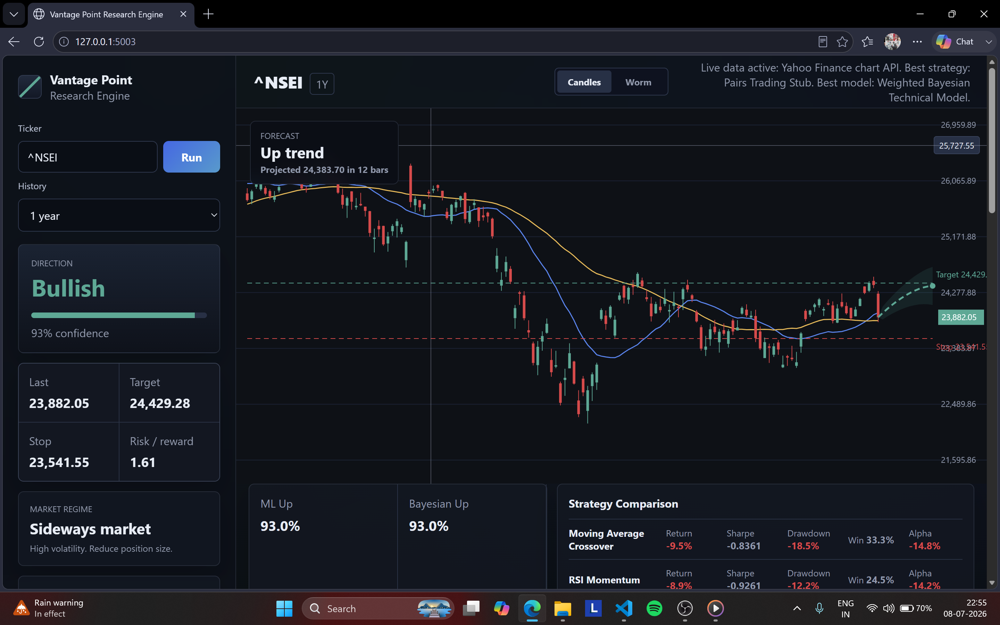

# Vantage Point Research Engine

<p align="center">
  
</p>

Vantage Point Research Engine is a standalone quant research platform. 

The engine packages a modular research stack behind a Flask API and a dark-themed single-page dashboard. Run predictions, backtests, Monte Carlo simulations, and optional ML inference from one interface.

## Features

### Directional prediction

- **Bullish / Bearish / Sideways** classification from probability thresholds (≥ 0.55 Bullish, ≤ 0.45 Bearish, else Sideways)
- **Confidence score** (0–100%) from max(probability_up, 1 − probability_up)
- **Dual prediction engines:**
  - **Fallback: Weighted Bayesian Technical Model** using `BayesianUpProbability` + `WeightedScore`
- **Volatility-adjusted signal** — raw probability penalized by ATR% to reduce overconfidence in high-volatility regimes

### Price forecast

- **12-bar forecast path** with upper/lower confidence bands
- Expected price, trend (Up / Down / Flat), and forecast confidence
- Target and stop-loss overlays on the price chart

### Risk management and trade monitor

- **Side:** Long / Short / Watch
- **ATR-based stop-loss and target** (1.4× ATR stop, 2.25× ATR target)
- **Risk/reward ratio**, suggested quantity, and risk budget ($10k account, 1% risk default)
- **Kelly fraction**, max position value, and volatility-adjusted allocation
- **Live trade monitor** — saves the last prediction as an entry to `.app_state/last_entry.json` and tracks PnL, PnL %, current price, side, and entry time
- Monitor auto-refreshes every **15 seconds** via `/api/monitor`

### Backtesting and strategy library

Six built-in strategies with shifted signals to avoid look-ahead bias:

1. **Moving Average Crossover** (SMA20 vs SMA50)
2. **RSI Momentum**
3. **Breakout** (20-bar high/low)
4. **Bollinger Reversal**
5. **ADX Trend**
6. **Pairs Trading Stub** (relative-strength z-score style)

Each strategy includes transaction costs (8 bps) and slippage (4 bps), with long/short support and portfolio-ready equity/drawdown curves.

### Performance analytics

Per-strategy metrics:

- Total return, benchmark return, annualized return, CAGR
- Sharpe, Sortino, max drawdown, Calmar
- VaR 95%, CVaR 95%
- Win rate, profit factor, trade count, holding period, exposure time
- Alpha, beta, information ratio

### Machine learning

**Feature columns (13 inputs):** `DailyReturn`, `RollingReturn5`, `RollingVolatility`, `VolumeChange`, `Momentum10`, `PriceGap`, `MACD`, `MACDSignalGap`, `RSI`, `ATRPct`, `RelativeStrength`, `WeightedScore`, `BayesianUpProbability`

**Trained models (`train_models.py`):**

| Model | Availability |
|-------|--------------|
| Logistic Regression (StandardScaler pipeline) | Always |
| Random Forest (260 trees, max_depth=9) | Always |
| XGBoost | Optional |
| LightGBM | Optional |
| Simple Neural Network (MLP 32→16) | With `--include-neural` |

**Training defaults:** 9 symbols (AAPL, MSFT, TSLA, NVDA, AMZN, GOOGL, META, SPY, QQQ), 10y daily history, 5-day horizon, 78/22 chronological split, best model selected by ROC-AUC then accuracy.

**Runtime inference:** per-model probability_up, best model selection, leaderboard, and volatility adjustment.

**Evaluation (dashboard + research API):** accuracy, precision, recall, F1, Brier score, calibration curve buckets.

### Feature engineering

- **Price:** DailyReturn, LogReturn, RollingReturn5/20, Momentum10, PriceGap, VolumeChange
- **Technical:** SMA20/50, EMA12/26, MACD, MACDSignal, RSI, Bollinger Bands, Stochastic, ADX, CCI
- **Volatility:** ATR, ATRPct, RollingVolatility, HistoricalVolatility, VolatilityRegime, BollingerWidth
- **Market:** BenchmarkReturn, RelativeStrength, MarketBreadth, VIXProxy
- **Scoring:** WeightedScore → BayesianUpProbability
- **Adaptive windows:** short ranges use SMA 12/26 instead of 20/50 when fewer than 120 bars are available

### Data pipeline and sources

**Live provider fallback chain:**

1. Yahoo Finance Chart API (`query1.finance.yahoo.com/v8/finance/chart/`)
2. `yfinance` library download
3. Stooq CSV API (`stooq.com/q/d/l/`)

**Offline demo fallback:** persistent synthetic OHLCV saved to `.app_state/demo_history/{symbol}_{period}.csv`

**Data cleaning (`clean_market_data`):** deduplication, sorting, numeric coercion, missing-value forward/back fill, outlier flags (|z-score| > 4 on returns), and corporate-action hooks (uses adjusted prices when available).

**Caching:** in-memory history cache (300s TTL), Yahoo timezone cache in `.app_state/yf_cache`.

### Market regime detection

- **Trend regimes:** Bull market, Bear market, Sideways market
- **Volatility regimes:** High / Normal / Low volatility
- **Adaptive strategy recommendations** (e.g., increase exposure, reduce position size)

### Monte Carlo simulation

- 1000 paths, 30-bar horizon
- Expected price, expected return, probability positive, worst 5%, best 95%, risk of ruin, sample paths

### Portfolio optimization

- Efficient frontier points
- Mean-variance (max Sharpe weight)
- Risk parity weight
- Minimum volatility portfolio weight
- Asset/cash allocation split

### Explainable AI (XAI)

- Prediction label: **BUY / SELL / WATCH**
- Confidence, **reasons** (momentum, MACD, volatility, RSI), and **risks** tags
- Feature importance (Momentum10, MACDSignalGap, ATRPct, RelativeStrength)
- SHAP hooks ready for trained tree/model explainers

### Time-series validation

- Chronological train/test split (70/30)
- Walk-forward validation windows
- Rolling window testing (126 bars)
- Out-of-sample flag
- Look-ahead bias guard and data leakage guard

### Research hypothesis and statistical significance

- **Primary hypothesis:** H₀ — composite technical signal has no predictive power (50% accuracy, zero excess return); H₁ — signal predicts direction and/or generates non-zero excess returns
- **Three statistical tests** at α = 0.05:
  1. **Directional signal accuracy** — two-sided binomial z-test on BayesianUpProbability vs next-day direction
  2. **Strategy excess return** — one-sample t-test on best-strategy daily excess returns vs benchmark
  3. **Momentum predictive power** — correlation t-test between Momentum10 and next-day returns
- Per-test p-values, significance labels, sample sizes, and conclusions
- **Overall conclusion** synthesizing significant test count
- Included in research API payload, dashboard panels, and auto-generated research paper

### Research documentation

- Auto-generated **Vantage Point Research Paper** markdown (problem, dataset, features, methodology, models, results, limitations, future work)
- **Roadmap coverage** panel tracking 20 research areas

### Dashboard UI

Dark terminal-themed single-page app (vanilla HTML/CSS/JS, Canvas charts):

**Sidebar**

- Ticker input and history period selector
- Direction with confidence meter
- Price levels (Last, Target, Stop, Risk/Reward)
- Market regime and adaptive action
- Data source status (Live vs Demo) with provider detail/errors
- Risk layer / trade monitor (PnL, side, qty, entry, move %)

**Workspace**

- **Chart:** Candles and Worm (line) modes, SMA20/SMA50 overlays, target/stop lines, forecast path with confidence band, crosshair with price label
- **Indicator strip:** ML Up probability, Bayesian Up, Weighted Score, ATR
- **Strategy comparison table:** Return, Sharpe, Drawdown, Win rate, Alpha per strategy
- **Analytics tabs:** Model Performance (leaderboard + calibration), Equity Curve, Drawdown
- **Research grid:** Explainable AI, Monte Carlo, Portfolio, Validation, Research Hypothesis, Statistical Significance, Roadmap Coverage, Research Documentation

Auto-loads prediction on page load; period change triggers a new prediction.

## Run

```powershell
cd "replace with where the program is installed"
python -m pip install -r requirements.txt
python app.py
```

Open:

```text
http://127.0.0.1:5003
```

**Dependencies:** Flask, yfinance, pandas, numpy, scikit-learn, joblib

## Supported history ranges

| Period | Interval |
|--------|----------|
| `1d` | 5-minute candles |
| `5d` | 15-minute candles |
| `3mo` | 1-hour candles |
| `6mo` | Daily candles |
| `1y` | Daily candles |
| `2y` | Daily candles |
| `5y` | Weekly candles |

Short ranges use adaptive indicator windows so the app has enough usable data for prediction, backtesting, and the forecast path.

Minimum row checks: 35 (1d), 50 (5d), 80 (other periods).

## Train models

Train Logistic Regression and Random Forest:

```powershell
python train_models.py
```

Train with custom symbols:

```powershell
python train_models.py --symbols AAPL MSFT SPY QQQ NVDA TSLA --period 10y --horizon-days 5
```

Include the optional simple neural network:

```powershell
python train_models.py --include-neural
```

The trained model suite is saved to:

```text
models/vantage_point_models.joblib
```

Legacy models saved as `models/pulse_v3_models.joblib` are still loaded automatically if the new filename is not present.

## Optional models

XGBoost, LightGBM, and TensorFlow are optional because they can be heavy and may not install cleanly on every Python version.

```powershell
python -m pip install -r optional-requirements.txt
```

If XGBoost or LightGBM is installed, `train_models.py` automatically includes them.

## API

Flask server on `127.0.0.1:5003`.

| Endpoint | Method | Purpose |
|----------|--------|---------|
| `/` | GET | Serves the dashboard |
| `/api/predict` | GET | Full prediction payload (candles, forecast, backtests, monitor, ML) |
| `/api/backtest` | GET | Strategy backtest results only |
| `/api/research` | GET | Full research roadmap payload |
| `/api/monitor` | GET | Live PnL monitor for saved entry |
| `/api/last-entry` | GET | Saved entry metadata |

**Query parameters:**

- `symbol` — ticker (default `AAPL`)
- `period` — history range (default `1y` for predict, `2y` for backtest/research)
- `record` — `1` or `0` on `/api/predict`; whether to save entry (default `1`)

**Examples:**

```text
GET /api/predict?symbol=AAPL&period=1y
GET /api/backtest?symbol=AAPL&period=2y
GET /api/research?symbol=AAPL&period=2y
GET /api/monitor
GET /api/last-entry
```

## Project structure

```text
vantage_point_research_engine/
├── app.py                 # Flask server, data providers, prediction API
├── research_platform.py   # Features, backtesting, research payload
├── train_models.py        # ML training CLI
├── templates/index.html   # Dashboard template
├── static/
│   ├── css/styles.css
│   └── js/app.js          # Chart rendering, API calls, monitor refresh
├── models/                # Trained model bundle (gitignored)
└── .app_state/            # Cache, demo history, last entry (gitignored)
```

## Implemented vs scaffolded

| Fully working | Scaffolded / placeholder |
|---------------|--------------------------|
| Prediction, forecast, risk sizing, trade monitor | Alternative data feeds (news, earnings, insider, social) |
| 6-strategy backtesting with costs | LSTM, Transformer, CatBoost models |
| ML training (LR, RF, optional XGB/LGBM/MLP) | Docker / cloud deployment files |
| Feature engineering and data cleaning | Full SHAP analysis |
| Monte Carlo, regime detection, XAI rules | PDF automated reporting |
| Research hypothesis and statistical significance tests | Bonferroni / FDR multiple-testing correction |
| Canvas dashboard with live/demo data | Pairs/cointegration live trading |
| 5 REST API endpoints | Reinforcement learning agent |

## Demo Video

Watch the full walkthrough:

[▶ Vantage Point Research Engine Demo](./demo%20video.mp4)

## Disclaimer

Vantage Point Research Engine is for education and research. It is not financial advice.
